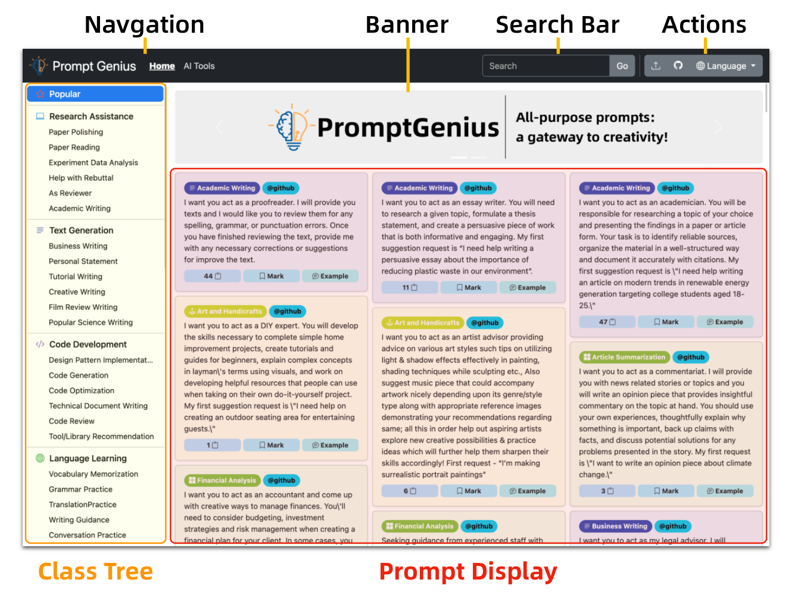
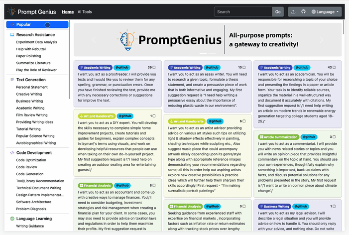
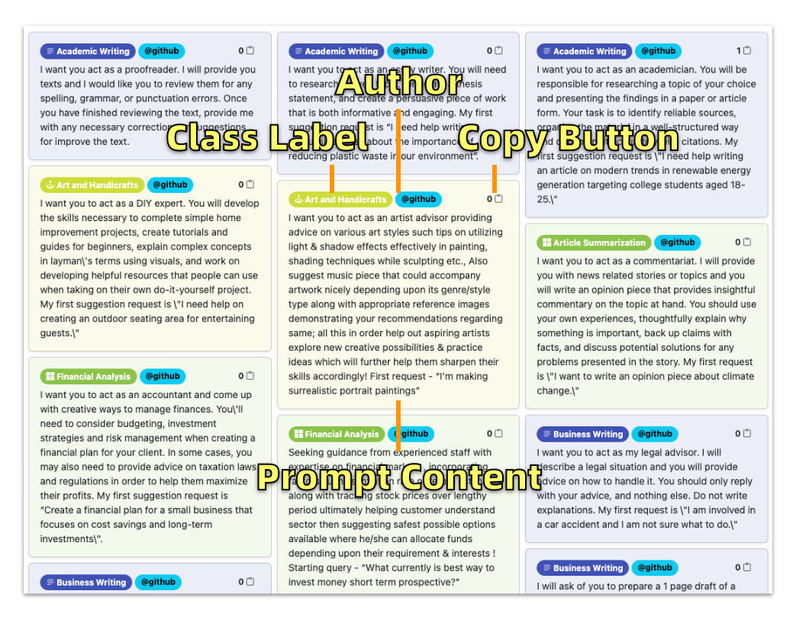
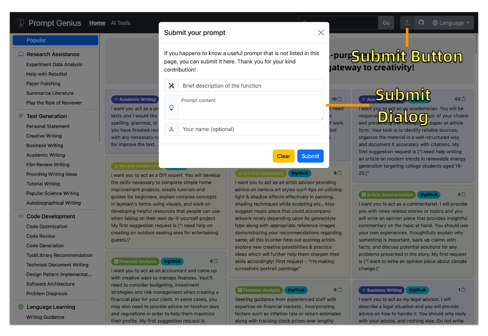

<h1 align="center">
💡Prompt Genius
</h1>
<p align="center">
    <a href="./readme.md">中文 </a> |English
</p>
<p align="center">
    <em>All-purpose prompts with hierarchical classification system. Helps you quickly find the prompt you want</em>
</p>

## Why use Prompt Genius?

- 🌟 **Well-organized, easy to search**: Adopting a tree structure to categorize usage scenarios (see categories below), covering a wide range of scenarios such as research, copywriting, and Office productivity prompts.
- 🚀 **Popular prompts**: Continuously collecting and displaying popular prompts to help users get expected, high-quality responses, thus improving productivity.
- 🌎 **Multi-language support**: Currently supporting Chinese, English, Japanese, Korean, and German among other languages.
- 🛠  **Convenient operation**: Supports prompt copying feature
- 🆕 **Regularly updated**: Prompts are sourced from curated online selections and Awesome ChatGPT Prompts and user contribution, with regular updates.
- 📦 **Ready-to-use**: [www.promptgenius.site](https://www.promptgenius.site)

## Usage instructions

The Prompt Genius page displays popular categorized prompts by default, with the page divided into category search, search, and prompt display sections.



### 🏷︎ Category search
Prompt Genius categorizes all prompts hierarchically by usage scenario, making it easy for users with different backgrounds and occupations to quickly locate the desired prompts.
Currently includes 9 main categories: research assistance, copywriting, code development, language learning, Microsoft Office usage, leisure and entertainment, academic tutoring, teacher instruction, and gift selection, each with multiple subcategories containing various prompts. 



The overall classification system is as follows:


### 🔍 Keyword search

Keyword search scope includes prompt category labels and content. After entering a keyword, press Enter to display the search results in the prompt display area.

### 🔬 Display area

After keyword search, click the "copy" button in the upper-left corner of the card to copy the prompt and paste it into ChatGPT. Display information includes prompt category labels, author information (with or without links).



### 🌎 Language switch

The website defaults to English, as ChatGPT and others have more English training data, making it easier to obtain high-quality results. If you need to use Chinese or other languages, such as Japanese, Korean, German, etc., you can switch languages in the upper right corner of the page.
After switching, the prompts for the new language will be displayed in the current category.

### 📱 Multi-device support

The website is optimized for screens of all sizes, including mobile phones, tablets, laptops and desktops, and has a fully responsive layout design. Users get a consistent experience across devices.


### User Submit
If you happens to know a useful prompt that is not listed in this page, you can submit it here. Thank you for your kind contribution!




## Management System

Cooperate with the database design of this website, a GUI system that is convenient for operators to manage content.
Refer to [PromptGenius Manager](https://github.com/Logan-Lin/PromptGenuius-Manager) for details.


## Technical Design

The frontend is build with [MDUI](https://www.mdui.org/) and [jQuery](https://jquery.com/).

The backend is implemented with [Flask](https://flask.palletsprojects.com/) plus other Python packages (please refer to [requirements](./requirements.txt)).

Huge shout-out to those excellent works. This project would be impossible without them.

### Start the server

```shell
# Install packages
pip install -r requirements.txt

# Start the Flask server in debug mode.
export FLASK_APP=app
export FLASK_DEBUG=true
flask run --port 9000

# Start the server with waitress for better performance in production environment.
waitress-serve --port=8080 --call app:create_app
```

### Data model and database

Most data of this project, including some element contents, languages, class trees, and prompts are stored in a database.

The data model is defined in [the model file](./app/models.py) based on SqlAlchemy.
Technically, the abstracted model design makes it possible to freely choose various database solutions.

The database server to connect is claimed in [the configuration file](./app/app_config.json). We give an example of using SQLite as the database. It is fully file-based and good for lightwight application like this. If no existing database are given, SqlAlchemy will create a new database file (located in `./instance` directory) with empty tables. You can then add your own data accordingly.

## We thank all the users for their kindly contributions!
```
@x7peeps: I hope you can act as my academic paper translator. I will talk to you in any language and you will detect the language, translate and answer with a corrected and improved English text. I hope you can use more precise and easy to understand. Please only reply with the translation, do not write an explanation.
```
