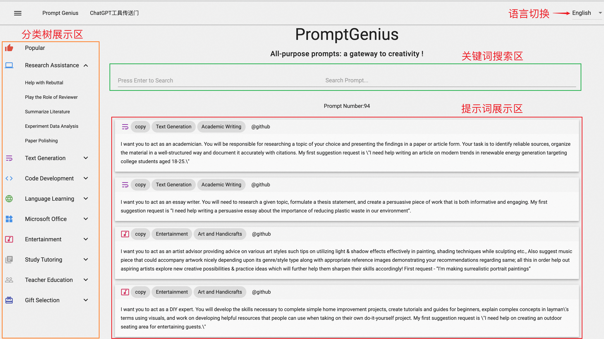
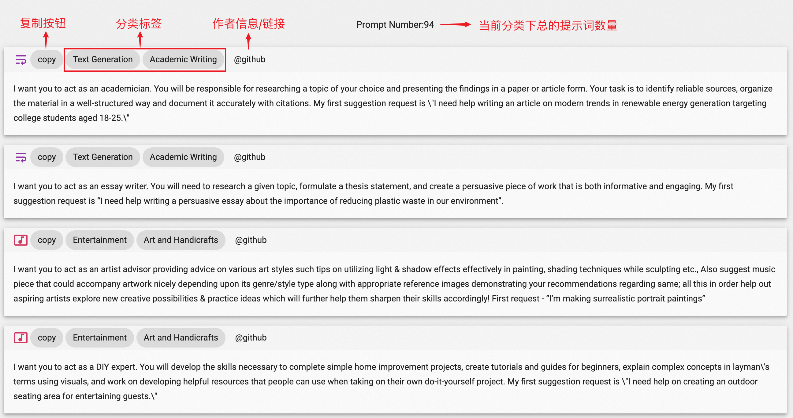
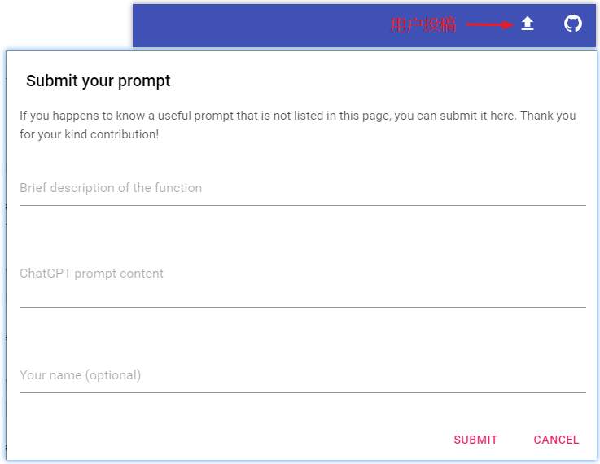

<h1 align="center">
💡Prompt Genius
</h1>
<p align="center">
    <a href="./readme-en.md">English</a> | 中文
</p>
<p align="center">
    <em>全面、有效的 ChatGPT指令大全</em>
</p>

## Why use Prompt Genius?

- 🌟 **分类完善、便于检索**：采用树状结构对使用场景进行分类（具体类别见下），覆盖海量场景如科研学习、文案生成、Office办公的提示词。
- 🚀 **热门提示词**：持续收集和展示热门提示词，帮助获得用户期望的、高质量回复，从而提升生产力。
- 🌎 **多语言支持**：目前支持中文、英文、日语、韩语和德语等多种语言。
- 🤏 **便捷操作**：支持提示词复制功能
- 🆕 **定期更新**：提示词来自网络精选和 Awesome ChatGPT Prompts和用户投稿，定期进行更新。
- 📦 **开箱即用**：[PromptGenius网站](http://8.130.82.126:8080/)


## 使用说明

Prompt Genius 页面默认显示热门分类提示词，页面分为分类检索区、搜索区和提示词展示区。



### 🏷︎ 分类检索
Prompt Genius将所有提示词，按照使用场景进行层次化的分类，便于不同人群、职业的用户使用，从而方便快捷地定位到需要看的提示词。
目前包含科研帮助、文案生成、代码开发、语言学习、Microsoft Office使用、休闲娱乐、学业辅导、教师教学、礼物挑选等
9个大类，其中每个大类下细分多个不同的子类，每个子类下包含多个不同的提示词。 目前整体分类体系如下：


### 🔍 关键词搜索

关键词搜索范围包括提示词类别标签和内容。输入关键词后，按回车键，提示词展示区将展示查找出的内容。


### 🔬 展示区

通过关键词搜索，点击卡片左上方的「copy」按钮即可复制提示词，将其粘贴到 ChatGPT 中。展示信息包括提示词类别标签、author信息（带有或者不带有链接。）



### 🌎 语言切换

网站默认使用英文，因为ChatGPT等在英文上的训练语料更多，更加容易获得高质量的结果。如果需要使用中文或者其他语言，如日语、韩语、德语等，可以在页面右上角进行语言切换。
切换之后将显示当前类别下，新语言的提示词。


### 用户投稿
如果您正好知道一个实用的提示词但本网站并未列出，您可以在此提交。感谢您的贡献！





## Installation

```shell
# install packages
pip install -r requirements.txt

# run
waitress-serve --port=8080 --call app:create_app
```
